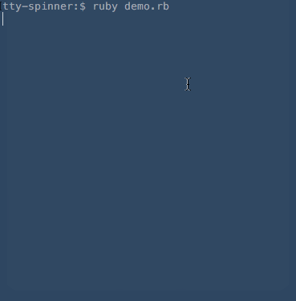

# TTY::Spinner [][gitter]
[][gem]
[][travis]
[][codeclimate]
[][coverage]
[][inchpages]

[gitter]: https://gitter.im/piotrmurach/tty
[gem]: http://badge.fury.io/rb/tty-spinner
[travis]: http://travis-ci.org/piotrmurach/tty-spinner
[codeclimate]: https://codeclimate.com/github/piotrmurach/tty-spinner
[coverage]: https://coveralls.io/r/piotrmurach/tty-spinner
[inchpages]: http://inch-ci.org/github/piotrmurach/tty-spinner

> A terminal spinner for tasks that have non-deterministic time frame.

**TTY::Spinner** provides independent spinner component for [TTY](https://github.com/piotrmurach/tty) toolkit.



## Installation

Add this line to your application's Gemfile:

```ruby
gem 'tty-spinner'
```

And then execute:

    $ bundle

Or install it yourself as:

    $ gem install tty-spinner

## Contents

* [1. Usage](#1-usage)
* [2. API](#2-api)
  * [2.1 spin](#21-spin)
  * [2.2 auto_spin](#22-auto_spin)
  * [2.3 run](#23-run)
  * [2.4 start](#24-start)
  * [2.5 stop](#25-stop)
    * [2.5.1 success](#251-success)
    * [2.5.2 error](#252-error)
  * [2.6 update](#26-update)
  * [2.7 reset](#27-reset)
  * [2.8 join](#28-join)
* [3. Configuration](#3-configuration)
  * [3.1 :format](#31-format)
  * [3.2 :frames](#32-frames)
  * [3.3 :interval](#33-interval)
  * [3.4 :hide_cursor](#34-hide_cursor)
  * [3.5 :clear](#35-clear)
  * [3.6 :success_mark](#36-success_mark)
  * [3.7 :error_mark](#37-error_mark)
  * [3.8 :output](#38-output)
* [4. Events](#4-events)
  * [4.1 done](#41-done)
  * [4.2 success](#42-success)
  * [4.3 error](#43-error)

## 1. Usage

**TTY::Spinner** by default uses `:classic` type of formatter and requires no paramters:

```ruby
spinner = TTY::Spinner.new
```

In addition you can provide a message with `:spinner` token and format type you would like for the spinning display:

```ruby
spinner = TTY::Spinner.new("[:spinner] Loading ...", format: :pulse_2)
30.times do
  spinner.spin
  sleep(0.1)
end
spinner.stop('Done!')
```

This would produce animation in your terminal:

```ruby
⎺ Loading ...
```

and when finished output:

```ruby
_ Loading ... Done!
```

For more usage examples please see [examples directory](https://github.com/piotrmurach/tty-spinner/tree/master/examples)

## 2. API

### 2.1 spin

The main workhorse of the spinner is the `spin` method.

Looping over `spin` method will animate a given spinner.

```ruby
loop do
  spinner.spin
end
```

### 2.2 auto_spin

To perform automatic spinning animation use `auto_spin` method like so:

```ruby
spinner.auto_spin
```

The speed with which the spinning happens is determined by the `:interval` parameter. All the spinner formats have their default intervals specified ([see](https://github.com/piotrmurach/tty-spinner/blob/master/lib/tty/spinner/formats.rb)).

### 2.3 run

Use `run` with a code block that will automatically display spinning animation while the block executes and finish animation when the block terminates. Optionally you can provide a stop message to display when animation is finished.

```ruby
spinner.run('Done!') { ... }
```

### 2.4 start

In order to set start time or reuse the same spinner after it has stopped, call `start` method:

```ruby
spinner.start
```

### 2.5 stop

In order to stop the spinner call `stop`. This will finish drawing the spinning animation and return to new line.

```ruby
spinner.stop
```

You can further pass a message to print when animation is finished.

```ruby
spinner.stop('Done!')
```

#### 2.5.1 success

Use `success` call to stop the spinning animation and replace the spinning symbol with checkmark character to indicate successful completion.

```ruby
spinner = TTY::Spinner.new("[:spinner] Task name")
spinner.success('(successful)')
```

This will produce:

```
[✔] Task name (successful)
```

#### 2.5.2 error

Use `error` call to stop the spining animation and replace the spinning symbol with cross character to indicate error completion.

```ruby
spinner = TTY::Spinner.new("[:spinner] Task name")
spinner.error('(error)')
```

This will produce:

```ruby
[✖] Task name (error)
```


### 2.6 update

Use `update` call to dynamically change label name(s).

Provide an arbitrary token name(s) in the message string, such as `:title`

```ruby
spinner = TTY::Spinner.new("[:spinner] :title")
```

and then pass token name and value:

```ruby
spinner.update(title: 'Downloading file1')
```

next start animation:

```ruby
spinner.run { ... }
# => | Downloading file1
```

Once animation finishes you can kick start another one with a different name:

```ruby
spinner.update(title: 'Downloading file2')
spinner.run { ... }
```

### 2.7 reset

In order to reset the spinner to its initial frame do:

```ruby
spinner.reset
```

### 2.8 join

One way to wait while the spinning animates is to join the thread started with `start` method:

```ruby
spinner.join
```

Optionally you can provide timeout:

```ruby
spinner.join(0.5)
```

## 3. Configuration

There are number of configuration options that can be provided to customise the behaviour of a spinner.

### 3.1 :format

Use one of the predefined spinner styles by passing the formatting token `:format`

```ruby
spinner = TTY::Spinner.new(format: :pulse_2)
```

All spinner formats that **TTY::Spinner** accepts are defined in [/lib/tty/spinner/formats.rb](https://github.com/piotrmurach/tty-spinner/blob/master/lib/tty/spinner/formats.rb)

If you wish to see all available formats in action run the `formats.rb` file in examples folder like so:

```ruby
bundle exec ruby examples/formats.rb
```

### 3.2 :frames

If you wish to use custom formatting use the `:frames` option with either `array` or `string` of characters.

```ruby
spinner = TTY::Spinner.new(frames: [".", "o", "0", "@", "*"])
```

### 3.3 :interval

The `:interval` option  accepts `integer` representing number of `Hz` units, for instance, frequency of 10 will mean that the spinning animation will be displayed 10 times per second.

```ruby
spinner = TTY::Spinner.new(interval: 20) # 20 Hz (20 times per second)
```

### 3.4 :hide_cursor

Hides cursor when spinning animation performs. Defaults to `false`.

```ruby
spinner = TTY::Spinner.new(hide_cursor: true)
```

### 3.5 :clear

After spinner is finished clears its output. Defaults to `false`.

```ruby
spinner = TTY::Spinner.new(clear: true)
```

### 3.6 :success_mark

To change marker indicating successful completion use the `:success_mark` option:

```ruby
spinner = TTY::Spinner.new(success_mark: '+')
```

### 3.7 :error_mark

To change marker indicating error completion use the `:error_mark` option:

```ruby
spinner = TTY::Spinner.new(error_mark: 'x')
```

### 3.8 :output

To change where data is streamed use `:output` option like so:

```
spinner = TTY::Spinner.new(output: $stdout)
```

The output stream defaults to `stderr`.

## 4. Events

**TTY::Spinner** emits `:done`, `:success` and `:error` event types when spinner is stopped.

### 4.1 done

This event is emitted irrespective of the completion method. In order to listen for this event you need to register callback:

```ruby
spinner.on(:done) { ... }
```

### 4.2 success

This event is fired when `success` call is made. In order to respond to the event, you need to register callback:

```ruby
spinner.on(:success) { ... }
```

### 4.3 error

This event is fired when `error` completion is called. In order to respond to the event, you need to register callback:

```ruby
spinner.on(:error) { ... }
```

## Contributing

1. Fork it ( https://github.com/piotrmurach/tty-spinner/fork )
2. Create your feature branch (`git checkout -b my-new-feature`)
3. Commit your changes (`git commit -am 'Add some feature'`)
4. Push to the branch (`git push origin my-new-feature`)
5. Create a new Pull Request

## Copyright

Copyright (c) 2014-2016 Piotr Murach. See LICENSE for further details.
